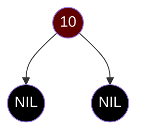
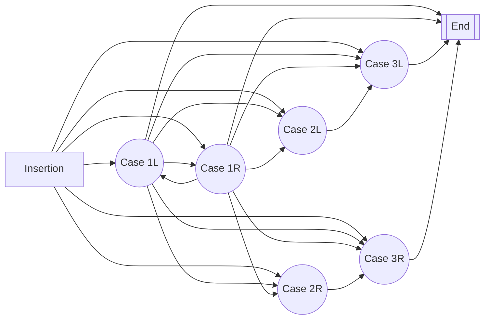
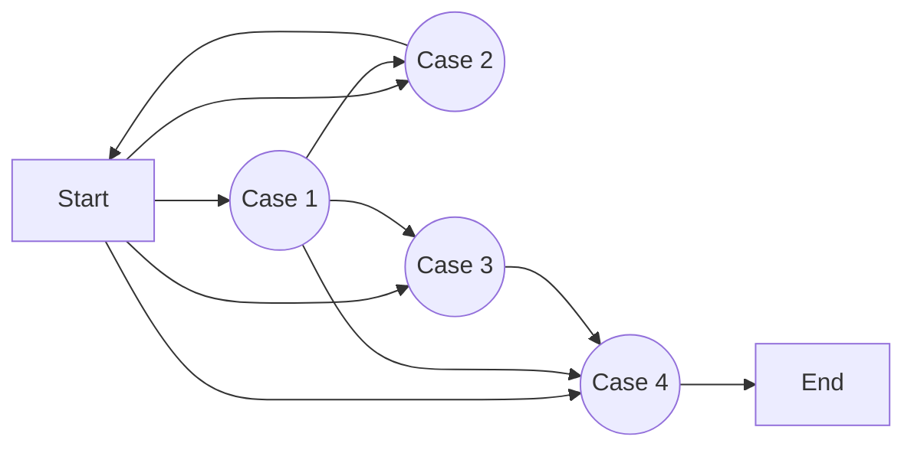
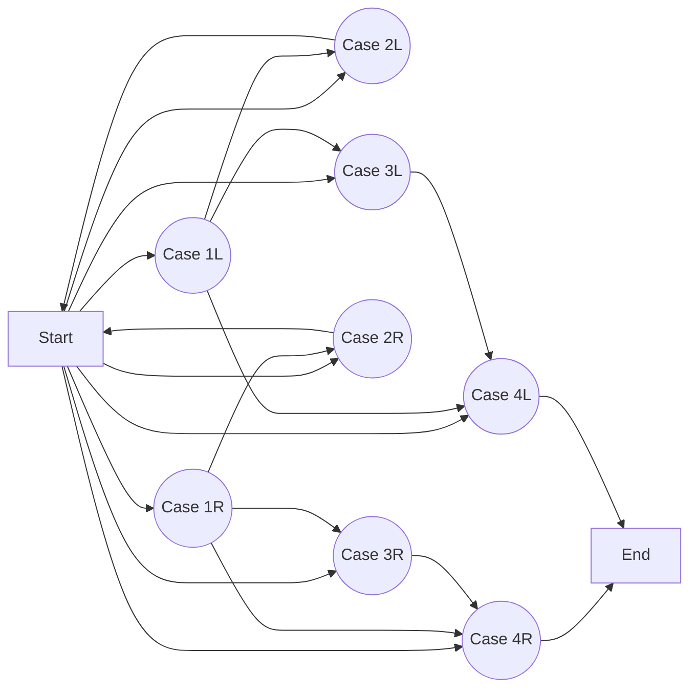
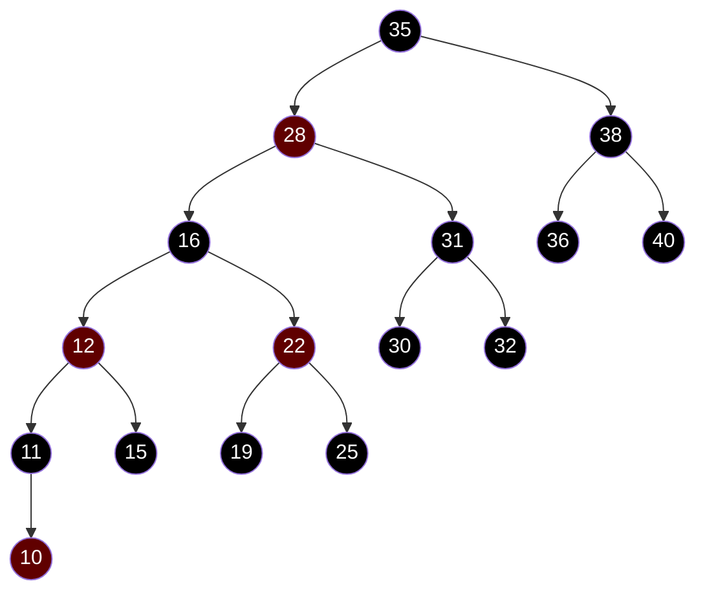

# Assignment 1: Red-Black Trees

Submitted to: Prof. C. Pandu Rangan 

Submitted by:

- Abhijit S. Iyer, Roll no: M21CS001
- Ashish Jacob Sam, Roll no: M21CS003
- Jayesh Budhwani, Roll no: M21CS007

---

- **Theory Assignment**:
  - [Give the formal proof for black-height maintenance for each case.](#Proof that Black height of tree is maintained after deletion)
  - [Draw the flow diagrams of insertion/deletion in Red-Black Tree.](#Flow Diagram of Deletion cases)

- **Programming Assignment**:
	- Implement Red-black tree with the methods:
	  - Search
	  - Insert
	  - Delete

---

# Theory Assignment

## Red-Black Trees

Red-black trees are Binary Search Trees which are self-balancing and process all its basic operations with $log_2(n)$ efficiency. They are an improvement over AVL Trees due to the fact that they require constant rotations for maintaining its balanced property (along with its special Red-Black Tree properties).

The node of a Red-Black Tree requires an to store an extra bit, to denote its color. A node in a Red-Black tree can be either Red or Black.

A given binary tree is a Red-Black Tree if is satisifies all the given properties:

1. Every node is either red or black
2. The root of the tree is black
3. Every leaf node (NIL) is black
4. If a node is red, all its child nodes must be black
5. For every node, all simple paths from the node to the decendant leaves must contain the same number of black nodes

We call the number of black nodes on any simple path from, but not including, a node x down to a leaf the black-height of the node, denoted $bh(x)$. By property `#5`, the notion of black-height is well defined, since all descending simple paths from the node have the same number of black nodes. We define the black-height of a red-black tree to be the black-height of its root.

It can be shown that the  black height of a Red-Black tree can be at most $2 log_2(n+1)$, i.e

$$
\text{Black Height} \le 2 log_2(n+1)
$$

This ensures that the Red-Black Tree is balanced. However, it is not as strict as AVL in this regard.

## Operations in a Red-Black Tree

The following operations can be performed in a Red-Black tree

- **Search**: Searches for an item in the tree. This operation returns a boolean value indicating the presence or absence of the queried value in the tree.
- **Insert**: Adds an element inside to the tree. Fails if the queried element is already present in the tree.
- **Delete**: Removes an element from the tree. Fails if the queried element does not exist in the tree.

### Search

Given a binary tree, all elements are stored such that all elements in a left subtree of a node are less than its own value, and all elements stored in the right subtree are greater. This allows to employ a binary search on a node. Thus, Search on a Red-Black tree has $log_2(n)$ efficiency.

### Insert

Insertion in a red-black tree is done by adding a Red node as a child node of the parent which is obtained by performing a search on the tree, thus maintaining the sorted order of the elements of the tree. 

In order to satisfy the Property `#3` of Red-Black Tree, a sential node of black color is attached as the child node of every node to add.

As an example, in order to add the element `10` to the tree, initially a node will be created as follows:



The Non-sential node will be attached as the child node of the node returned by the binary search of the node.

The tree is then "fixed" up from the bottom(leaf) nodes in upward direction. We assign the function `FixNode()` to be responsible for this "fixing".

The `FixNode()` method ensures that the tree is a Red-Black Tree. Since the black height of the tree is maintained to be less than $2log_2(n)$, it implies that ensuring that the tree is Red-Black also ensures that its balanced height is maintained as well. Therefore, the `FixNode()` method only needs to ensure that the 5 properties of a red-black tree is followed.

If the `FixNode()` operation is called after insertion in a Tree that was a Red-Black tree before insertion, it implies that Property `#1` is already true, and it will be true after the insertaion as well since the nodes inserted are already discussed to be a red node with black NIL nodes. The `FixNode()` should ensure that the root node's color is set to black before exit, to ensure Property `#2`. Property `#3` is already ensured as the added node is attached to black NIL nodes.

Therefore, the `FixNode()` function only needs to ensure that the properties `#4` and `#5` are satisfied.

Since every inserted node is a red node, the "fixing" process should begin (and continue recursivly, if necessary) as long as the node's direct parent is also red.

Based on the neighbourhood of the inserted node, the `FixNode()` function will be called on a node having one of the following configurations

#### Case 1:

Case 1 can be any of the 4 configurations given as follows:

All of these configurations have the "Uncle" Node (Other child of Grandfather node) as Red.

In this case, colors of the GrandFather node, Father node and the uncle nodes are inverted to obtain the following result


This is a simple approach, but the the Grandfather node in this case might need fixing again, if the Parent of the GrandFather node is a red node (Since it would be a violation of Property `#4`). This is done by calling the `FixNode()` method recursively on the GrandFather node.

#### Case 2:

Case 2 can be present as follows:


In contrast to Case 1, the Uncle node here has the color black. Also the Child node is on the same side of the father as the Uncle node is attached on the GrandFather node. In this case a left-rotate/right-rotate operation at the Father node is performed to obtain the following.

The subtree is still not solved, as the red father node still has a red child node. By doing this operation, the subtree is reduced to the Case 3 configuraion.

#### Case 3:

Consider the configuration


In this case, the GrandFather node is colored Red, and another left-rotation/right-rotation os done on the GrandFather node to obtain the following.
At this stage, the Red-Black tree is fixed completely. 


#### Flow-diagram of all cases



### Deletion

<<<<<<< HEAD
<<<<<<< HEAD
Similar to Insertions, there are multiple cases in deletions, which are given as follows:

=======
<<<<<<< HEAD
=======
>>>>>>> d7651937b16a99add4f966933c998430d3808607
The deletion function refers to removal of an item from the dictionary. In the case of a Red-black tree, the process of deletion is a bit similar that of deletion in an AVL tree: to delete a node, we try to replace it with an appropriate node from its child subtree (if available), and then proceed to remove the said node from the tree.

This deletion process removes a single node from the tree, and in it's place another node will be transplanted. Being an extended binary tree, this replacement node can be a data node, or a NIL node. We will label the deleted node as Y, and the replacement node as X.

The node which is to be deleted is searched. Once obtained, there are multiple cases, which are given as follows:

- If both the child nodes are sential, the deleted node is replaced with NIL node or the sential node.
- If the given node has one sential and one non-sential child node, the the said node is replaced by the non-sential child node.
- Otherwise, if both the child nodes are non-sential, then the said node is replaced by the one node in its child subtrees that is the closest to its value. This can be the maximum of the left subtree or the minimum of the right subtree. In this case, the selected closest node X is replaced by its child node, and Y is replaced by X. X is also made to be of the same color as Y.

#### All cases of fixdelete() call

In order to ensure that the tree remains a Red-Black Tree, we make the following fixups:

1. if the deleted node Y is red, and ...
  - a. if the replacement X is a red node, and no recoloration was done(That is, if Y has at least one child node as NIL), no fixup is required since all the properties of a Red-Black tree are unaffected.  (fixdelete not called)
  - b. if the replacement X is a red node where Y has no NIL child node, after recoloration it can only be assigned red, and again no fixup is required.
  - c. if the replacement X is black and got recolored to red, the fixup method only requires a single assignment of color: Changing Color of X's child to black. (Case 0)
2. if the deleted node Y is black, and ...
     1. if the replacement node X is red or NIL, X is colored to be black, and the fix function ends. (Case 0)
     2. if the replacement node is black, or is colored black after deletion, we check for the sibiling of X (say W)
          1. if W is red, W is colored to black, X's parent is colored to red, and the parent is rotated. The tree is again checked if fixing is further required (Case 1)
          2. if W is black, and both child nodes of W is black, W is colored to be red, and the fixdelete function is called at the parent of W. (Case 2)
          3. if any of the child nodes of w is red, 
               1. one of them (on the same side as x is w.r.t its parent ) is assigned to be black, w is colured red and rotated. This makes the new W (sibiling of X) to be black and its other child as red. This leads to case 4. (Case 3) 
               2. It is ensured in this case that w is black and one of its child (at opposite side as x is w.r.t its parent) is red. The said red child is made to be black, w is assigned to the same color as x's parent, and then the parent is assigned to be black. Now a rotation is done about w and the process is complete. It also ensures that root node is black before exit. (Case 4)


#### Proof that Black height of tree is maintained after deletion

**NOTE:** Refer the previous heading "All cases of `fixdelete()`"

On observing the various cases of deletion mentioned above, we first note which cases actually affect the black height of the tree.

For points `(1.a)`, `(1.b)`, we know that black height will not be affected, since the tree did not lose any black node to begin with.

In point `(1.c)`, a black node is colored to red, so one of its child node is recolored to black, and it is assured that its sibiling is NIL (since it is the selected to be the minimum of its subtree). Therefore, the black height along the all paths again remains constant. 

All sub-points of (2) involve removal of a black node from the tree. This implies all path of nodes starting from the replacement node X have now 1 black node less than earlier. Thus, either we should regain a black node for all nodes in the subtree of X, or we can reduce the black height of all paths in subtrees which does not contain X. This might need to be carried out recursively for X, as long as X is black. If at any instant, the recursive call is made and if X turns out to be red, then X is simply recolored to gain back the black-height for all paths of it's subtree(Case 0). Thus, for every recursive call, the color of X is checked.

Point `(2.1)` regains a black node back for the subtree of X, so the black height is maintained (Case 0).

Therefore, we need to show that for Cases 1, 2, 3 and 4, the black height of the tree is maintained for all paths.

Point `(2.2.1)` or Case 1 reduces the black height of the sibling subtree by changing the sibling node W from black to red and doing a single rotation. In this case, we know for sure that the child nodes of W can only be black, since it is a red node (by property #4). This is shown as follows:


$$
\text{Let black height of node A be}\\bh(A)=x \\
\text{Since black height for A is reduced by 1 compared to the rest of the tree,} \\
\text{Black height of right subtree of B, i.e D is }\\ bh(D) = x + 1 \\
\text{Since w is a red node in this case}\\
bh(C) = bh(E) = x + 1 \\
\implies \text{subtree at B does not have its black height maintained}\\ \\

\text{After rotation and recoloring, }\\
bh(C) = x + 1, \\
bh(A) = x \\
$$
Thus, black height is still not maintained for the tree at the node B. This leads us to other cases, where the sibling node W is not Red. We have thus converted Case 1 to a different case when W is black, without affecting the black height of any nodes

Point `(2.2.2)` is a case where the node W is a black node with both its child nodes as black nodes as well as shown:


$$
\text{Let black height of node A be}\\bh(A) = x\\
\text{Since black height at A is reduced by 1 compared to the rest of the tree,}\\
\text{Black height of D is}\\
bh(D) = x+1\\ \implies bh(C) = bh(E) = x \\
\text{Thus, black height of tree is not maintained at B}\\ \\
\text{After Recoloring}\\
\\bh(A)=x \\
bh(C) = x\\ bh(E) = x\\
\text{since D is colored red} \\
bh(D) = x+1,
\\\text{Thus, black height of x+1 is maintained at node B at both sides}
$$
In this way, Case 2 maintains the black height of its subtree. Since this was achieved by lowering the black-height of the sibiling, the subtree (at node B) itself has black height reduced compared to its sibling, (unless the Node B in this case was the root node itself). Hence, this function is called again at the parent of X recursively.

Point `(2.2.3)` is a case when the W is a black node and not all of its children are black. Thus, the `fixdelete()` function checks for either Case 3 or Case 4.

Case 3 is depicted as follows, when one node of W (on the opposite side of X) is discovered to be black, as shown:


$$
\text{Let black height of A be}\\bh(A) = x\\
\text{Since black height at A is reduced by 1 compared to the rest of the tree,}\\
\text{Black height of D is}\\
bh(D) = x+1\\ 
\text{Since D is a black node}\\ bh(C) = bh(E) = bh (D) - 1 = x \\
\text{Thus, black height of tree is not maintained at B}\\ \\
\text{After Rotation and recoloring}\\
bh(A)=x\\
bh(E)=x\\
bh(C)=x+1
$$
Thus, the black height of tree is yet to be maintained at B, but this allows to move to Case 4, which is as shown:


$$
\text{Let black height of A be}\\bh(A) = x\\
\text{Since black height at A is reduced by 1 compared to the rest of the tree,}\\
\text{Black height of D is}\\
bh(D) = x+1\\ 
\text{Since D is a black node}\\ bh(E) = bh(C) = bh (D) - 1 = x   \\
\text{Thus, black height of tree is not maintained at B}\\ \\ \\ \text{After Rotation and recoloring}\\
bh(A) = x, \\
bh(C) = x, \\
\implies bh(B) = x+1

\\ \text{Since E earlier had height }x, \text{After being colored as black,}\\
bh(E) = x+1
\\ \text{Thus, black height is maintained at root D}
$$
Unlike Case 2, black height is regained for the entire subtree. Therefore, there is no need of any more recursive calls for `fixdelete()` function.

Therefore, we have proved for all cases that the deletion of node in this procedure will maintain the black height for all existing paths.

---
<div style="page-break-after: always; break-after: page;"></div>

#### Flow Diagram of Deletion cases

Any of the cases are reachable from Start, that is

- Start $\implies$ Case 1, 2, 3, 4

From Case 1, we can only go to Case 2, 3 and 4

- Thus Case 1 $\implies$ 2, 3, 4

Case 2 calls recursively on the function

- Thus, Case 2 $\implies$ Start, i.e Case 2 $\implies$ 1, 2, 3, 4

Case 3 can only go to Case 4, which can only lead to the end of the function, that is
<<<<<<< HEAD

- Case 3 $\implies$ Case 4 $\implies$ End

Taking into account all cases, that is Case 1, Case 2, Case 3 and Case 4, we get the following flow diagram:



And dividing each case as left and right cases, we get: 



---
<div style="page-break-after: always; break-after: page;"></div>

# Practical Assignment Write-up

## Implementation of Red-Black Tree
=======
>>>>>>> bce4e61b3fbaf6b6caf6e5f849b459cf0002c27a
//TODO

# Practical Assignment
>>>>>>> 7503bb0c2bea6d40d0a175a7a56522dbdfe7afbd
=======

- Case 3 $\implies$ Case 4 $\implies$ End

Taking into account all cases, that is Case 1, Case 2, Case 3 and Case 4, we get the following flow diagram:


And dividing each case as left and right cases, we get: 


---
<div style="page-break-after: always; break-after: page;"></div>

# Practical Assignment Write-up

## Implementation of Red-Black Tree
>>>>>>> d7651937b16a99add4f966933c998430d3808607

The code for the Red-Black Tree is given as shown

```c++
#define black true
#define red false
<<<<<<< HEAD
<<<<<<< HEAD
class RedBlackTree
{
private:
	Node *Root;
	int Count;
	Node *CreateNode(int value)
	{
		Node *x = new Node;
		x->LChild = NilNode();
		x->RChild = NilNode();
		x->LChild->Parent = x;
		x->RChild->Parent = x;
=======
class RedBlackTree : public AbstractBST
=======
class RedBlackTree
>>>>>>> d7651937b16a99add4f966933c998430d3808607
{
private:
	Node *Root;
	int Count;
	Node *CreateNode(int value)
	{
		Node *x = new Node;
<<<<<<< HEAD
		x->RChild = x->LChild = x->Parent = Sential;
>>>>>>> 7503bb0c2bea6d40d0a175a7a56522dbdfe7afbd
=======
		x->LChild = NilNode();
		x->RChild = NilNode();
		x->LChild->Parent = x;
		x->RChild->Parent = x;
>>>>>>> d7651937b16a99add4f966933c998430d3808607
		x->Color = red;
		x->Data = value;
		return x;
	}
<<<<<<< HEAD
<<<<<<< HEAD
=======
>>>>>>> d7651937b16a99add4f966933c998430d3808607
	Node *NilNode()
	{
		Node *x = new Node;
		x->RChild = x->LChild = x->Parent = nullptr;
		x->Color = black;
		return x;
	}
	bool isNil(Node *node)
	{
		return node->Color == black && (node->LChild == nullptr || node->RChild == nullptr);
	}
	void leftrotate(Node *x)
<<<<<<< HEAD
	{
		Node *y = x->RChild, *parent = x->Parent;
		x->RChild = y->LChild;
		x->RChild->Parent = x;
		y->LChild = x;
		y->Parent = parent;
		x->Parent = y;
		if (!isNil(parent))
		{
			if (parent->LChild == x)
				parent->LChild = y;
			else
				parent->RChild = y;
		}
		else
			Root = y;
	}
	void rightrotate(Node *y)
	{
		Node *x = y->LChild, *parent = y->Parent;
		y->LChild = x->RChild;
		y->LChild->Parent = y;
		x->RChild = y;
		x->Parent = parent;
		y->Parent = x;
		if (!isNil(parent))
		{
			if (parent->LChild == y)
				parent->LChild = x;
			else
				parent->RChild = x;
		}
		else
			Root = x;
	}
	Node *SearchNode(int data)
	{
		Node *x = Root;
		while (!isNil(x))
		{
			if (x->Data == data)
				return x;
			else if (x->Data < data)
				x = x->RChild;
			else
				x = x->LChild;
		}
		return nullptr;
=======
	Node *leftrotate(Node *x)
=======
>>>>>>> d7651937b16a99add4f966933c998430d3808607
	{
		Node *y = x->RChild, *parent = x->Parent;
		x->RChild = y->LChild;
		x->RChild->Parent = x;
		y->LChild = x;
		y->Parent = parent;
		x->Parent = y;
		if (!isNil(parent))
		{
			if (parent->LChild == x)
				parent->LChild = y;
			else
				parent->RChild = y;
		}
		else
			Root = y;
	}
	void rightrotate(Node *y)
	{
		Node *x = y->LChild, *parent = y->Parent;
		y->LChild = x->RChild;
		y->LChild->Parent = y;
		x->RChild = y;
		x->Parent = parent;
		y->Parent = x;
<<<<<<< HEAD
		return x;
>>>>>>> 7503bb0c2bea6d40d0a175a7a56522dbdfe7afbd
=======
		if (!isNil(parent))
		{
			if (parent->LChild == y)
				parent->LChild = x;
			else
				parent->RChild = x;
		}
		else
			Root = x;
	}
	Node *SearchNode(int data)
	{
		Node *x = Root;
		while (!isNil(x))
		{
			if (x->Data == data)
				return x;
			else if (x->Data < data)
				x = x->RChild;
			else
				x = x->LChild;
		}
		return nullptr;
>>>>>>> d7651937b16a99add4f966933c998430d3808607
	}
	void fixinsert(Node *x)
	{
		Node *father = x->Parent, *grandfather = father->Parent, *uncle;
<<<<<<< HEAD
<<<<<<< HEAD
		while (isNil(grandfather) == false && father->Color == red)
=======
		while (grandfather != Sential && father->Color == red)
>>>>>>> 7503bb0c2bea6d40d0a175a7a56522dbdfe7afbd
=======
		while (isNil(grandfather) == false && father->Color == red)
>>>>>>> d7651937b16a99add4f966933c998430d3808607
		{
			if (father == grandfather->LChild)
			{
				uncle = grandfather->RChild;
				if (uncle->Color == red)
				{
					uncle->Color = father->Color = black;
					grandfather->Color = red;
					x = grandfather;
				}
				else
				{
					if (x == father->RChild)
					{
<<<<<<< HEAD
<<<<<<< HEAD
						leftrotate(father);
=======
						grandfather->LChild = leftrotate(father);
						x->Parent = grandfather;
>>>>>>> 7503bb0c2bea6d40d0a175a7a56522dbdfe7afbd
=======
						leftrotate(father);
>>>>>>> d7651937b16a99add4f966933c998430d3808607
						x = father;
						father = grandfather->LChild;
					}
					father->Color = black;
					grandfather->Color = red;
<<<<<<< HEAD
<<<<<<< HEAD
					rightrotate(grandfather);
=======
					if (Root == grandfather)
						Root = rightrotate(grandfather);
					else
					{
						father = grandfather->Parent;
						if (grandfather == father->LChild)
							father->LChild = rightrotate(grandfather);
						else
							father->RChild = rightrotate(grandfather);
					}
>>>>>>> 7503bb0c2bea6d40d0a175a7a56522dbdfe7afbd
=======
					rightrotate(grandfather);
>>>>>>> d7651937b16a99add4f966933c998430d3808607
				}
			}
			else
			{
<<<<<<< HEAD
<<<<<<< HEAD
				uncle = grandfather->LChild;
=======
				uncle = grandfather->RChild;
>>>>>>> 7503bb0c2bea6d40d0a175a7a56522dbdfe7afbd
=======
				uncle = grandfather->LChild;
>>>>>>> d7651937b16a99add4f966933c998430d3808607
				if (uncle->Color == red)
				{
					uncle->Color = father->Color = black;
					grandfather->Color = red;
					x = grandfather;
				}
				else
				{
					if (x == father->LChild)
					{
<<<<<<< HEAD
<<<<<<< HEAD
						rightrotate(father);
=======
						grandfather->RChild = leftrotate(father);
>>>>>>> 7503bb0c2bea6d40d0a175a7a56522dbdfe7afbd
=======
						rightrotate(father);
>>>>>>> d7651937b16a99add4f966933c998430d3808607
						x->Parent = grandfather;
						x = father;
						father = grandfather->RChild;
					}
					father->Color = black;
					grandfather->Color = red;
<<<<<<< HEAD
<<<<<<< HEAD
					leftrotate(grandfather);
=======
					if (Root == grandfather)
						Root = rightrotate(grandfather);
					else
					{
						father = grandfather->Parent;
						if (grandfather == father->LChild)
							father->LChild = rightrotate(grandfather);
						else
							father->RChild = rightrotate(grandfather);
					}
>>>>>>> 7503bb0c2bea6d40d0a175a7a56522dbdfe7afbd
=======
					leftrotate(grandfather);
>>>>>>> d7651937b16a99add4f966933c998430d3808607
				}
			}
			father = x->Parent;
			grandfather = father->Parent;
		}
		Root->Color = black;
	}
<<<<<<< HEAD
<<<<<<< HEAD
=======
>>>>>>> d7651937b16a99add4f966933c998430d3808607
	void fixdelete(Node *x)
	{
		while (x != Root && x->Color == black)
		{
			Node *w, *father = x->Parent;
			if (father->LChild == x)
			{
				w = father->RChild;
				if (w->Color == red) //Case 1L
				{
					w->Color = black;
					father->Color = red;
					leftrotate(father);
					w = father->RChild;
				}
				if (w->LChild->Color == black && w->RChild->Color == black) //Case 2L
				{
					w->Color = red;
					x = x->Parent;
					father = x->Parent;
				}
				else
				{
					if (w->RChild->Color == black) //Case 3L
					{
						w->LChild->Color = black;
						w->Color = red;
						rightrotate(w);
						w = father->RChild;
					}
					w->Color = father->Color; //Case 4L
					father->Color = black;
					w->RChild->Color = black;
					leftrotate(father);
					x = Root;
				}
			}
			else
			{
				w = father->LChild;
				if (w->Color == red) //Case 1R
				{
					w->Color = black;
					father->Color = red;
					rightrotate(father);
					w = father->LChild;
				}
				if (w->LChild->Color == black && w->RChild->Color == black) //Case 2R
				{
					w->Color = red;
					x = x->Parent;
					father = x->Parent;
				}
				else
				{
					if (w->LChild->Color == black) //Case 3R
					{
						w->RChild->Color = black;
						w->Color = red;
						leftrotate(w);
						w = father->LChild;
					}
					w->Color = father->Color; //Case 4R
					father->Color = black;
					w->LChild->Color = black;
					rightrotate(father);
					x = Root;
				}
			}
		}
		if (!isNil(x))
			x->Color = black; //Case 0
	}
	void Transplant(Node *before, Node *after)
	{
		Node *parent = before->Parent;
		if (isNil(parent))
			Root = after;
		else if (parent->LChild == before)
			parent->LChild = after;
		else
			parent->RChild = after;
		after->Parent = parent;
	}
<<<<<<< HEAD
=======
>>>>>>> 7503bb0c2bea6d40d0a175a7a56522dbdfe7afbd
=======
>>>>>>> d7651937b16a99add4f966933c998430d3808607

public:
	RedBlackTree()
	{
<<<<<<< HEAD
<<<<<<< HEAD
=======
>>>>>>> d7651937b16a99add4f966933c998430d3808607
		Root = NilNode();
		Root->Parent = Root;
		Count = 0;
	}
	void Clear()
	{
		while (Count > 0)
		{
			int data = Root->Data;
			RemoveElement(data);
		}
<<<<<<< HEAD
	}
	bool AddElement(int element)
	{
		if (isNil(Root))
		{
			Node *nilnode = Root;
			Root = CreateNode(element);
			Root->Color = black;
			Root->Parent = nilnode;
			Count++;
=======
		Sential = CreateNode(0);
		Sential->Color = black;
		Root = Sential;
=======
>>>>>>> d7651937b16a99add4f966933c998430d3808607
	}
	bool AddElement(int element)
	{
		if (isNil(Root))
		{
			Node *nilnode = Root;
			Root = CreateNode(element);
			Root->Color = black;
<<<<<<< HEAD
>>>>>>> 7503bb0c2bea6d40d0a175a7a56522dbdfe7afbd
=======
			Root->Parent = nilnode;
			Count++;
>>>>>>> d7651937b16a99add4f966933c998430d3808607
			return true;
		}
		Node *a, *b;
		a = Root;
<<<<<<< HEAD
<<<<<<< HEAD
		while (!isNil(a))
=======
		while (a != Sential)
>>>>>>> 7503bb0c2bea6d40d0a175a7a56522dbdfe7afbd
=======
		while (!isNil(a))
>>>>>>> d7651937b16a99add4f966933c998430d3808607
		{
			b = a;
			if (a->Data == element)
				return false;
			if (a->Data < element)
				a = a->RChild;
			else
				a = a->LChild;
		}
<<<<<<< HEAD
<<<<<<< HEAD
		Node *temp = CreateNode(element), *delnode;
		temp->Parent = b;
		if (b->Data < temp->Data)
		{
			delnode = b->RChild;
			b->RChild = temp;
		}
		else
		{
			delnode = b->LChild;
			b->LChild = temp;
		}
		delete delnode;
		fixinsert(temp);
		Count++;
=======
		Node *temp = CreateNode(element);
=======
		Node *temp = CreateNode(element), *delnode;
>>>>>>> d7651937b16a99add4f966933c998430d3808607
		temp->Parent = b;
		if (b->Data < temp->Data)
		{
			delnode = b->RChild;
			b->RChild = temp;
		}
		else
		{
			delnode = b->LChild;
			b->LChild = temp;
		}
		delete delnode;
		fixinsert(temp);
<<<<<<< HEAD
>>>>>>> 7503bb0c2bea6d40d0a175a7a56522dbdfe7afbd
=======
		Count++;
>>>>>>> d7651937b16a99add4f966933c998430d3808607
		return true;
	}
	bool RemoveElement(int element)
	{
<<<<<<< HEAD
<<<<<<< HEAD
		Node *delnode = SearchNode(element), *fixnode, *successor;
		if (delnode == nullptr)
			return false;
		bool OriginalColor = delnode->Color;
		if (isNil(delnode->LChild))
		{
			fixnode = delnode->RChild;
			Transplant(delnode, fixnode);
			delnode->RChild = nullptr;
			delete delnode->LChild; //Extra NIL node
		}
		else if (isNil(delnode->RChild))
		{
			fixnode = delnode->LChild;
			Transplant(delnode, fixnode);
			delnode->LChild = nullptr;
			delete delnode->RChild; //Extra NIL node
		}
		else
		{
			successor = delnode->RChild;
			while (!isNil(successor->LChild))
				successor = successor->LChild;
			delete successor->LChild; //Extra NIL node
			OriginalColor = successor->Color;
			fixnode = successor->RChild;
			if (successor->Parent == delnode)
				fixnode->Parent = successor;
			else
			{
				Transplant(successor, fixnode);
				successor->RChild = delnode->RChild;
				successor->RChild->Parent = successor;
				delnode->RChild = nullptr;
			}
			Transplant(delnode, successor);
			successor->LChild = delnode->LChild;
			delnode->LChild = nullptr;
			successor->LChild->Parent = successor;
			successor->Color = delnode->Color;
		}
		if (OriginalColor == black)
			fixdelete(fixnode);
		delete delnode;
		Count--;
		if (Count == 0)
		{
			delnode = Root;
			Root = Root->Parent;
			delete delnode; //In case of root node,
							//Another leaf node is deleted
		}
		return true;
	}
	bool Contains(int element)
	{
		return SearchNode(element) != nullptr;
	}
	void PrintTree(void (*Printer)(Node *n))
	{
		if (!isNil(Root))
			Printer(Root);
=======
		//TODO: Complete implementation
		return false;
	}
	bool Contains(int element)
	{
		if (Root == Sential)
=======
		Node *delnode = SearchNode(element), *fixnode, *successor;
		if (delnode == nullptr)
>>>>>>> d7651937b16a99add4f966933c998430d3808607
			return false;
		bool OriginalColor = delnode->Color;
		if (isNil(delnode->LChild))
		{
			fixnode = delnode->RChild;
			Transplant(delnode, fixnode);
			delnode->RChild = nullptr;
			delete delnode->LChild; //Extra NIL node
		}
		else if (isNil(delnode->RChild))
		{
			fixnode = delnode->LChild;
			Transplant(delnode, fixnode);
			delnode->LChild = nullptr;
			delete delnode->RChild; //Extra NIL node
		}
		else
		{
			successor = delnode->RChild;
			while (!isNil(successor->LChild))
				successor = successor->LChild;
			delete successor->LChild; //Extra NIL node
			OriginalColor = successor->Color;
			fixnode = successor->RChild;
			if (successor->Parent == delnode)
				fixnode->Parent = successor;
			else
			{
				Transplant(successor, fixnode);
				successor->RChild = delnode->RChild;
				successor->RChild->Parent = successor;
				delnode->RChild = nullptr;
			}
			Transplant(delnode, successor);
			successor->LChild = delnode->LChild;
			delnode->LChild = nullptr;
			successor->LChild->Parent = successor;
			successor->Color = delnode->Color;
		}
		if (OriginalColor == black)
			fixdelete(fixnode);
		delete delnode;
		Count--;
		if (Count == 0)
		{
			delnode = Root;
			Root = Root->Parent;
			delete delnode; //In case of root node,
							//Another leaf node is deleted
		}
		return true;
	}
	bool Contains(int element)
	{
		return SearchNode(element) != nullptr;
	}
	void PrintTree(void (*Printer)(Node *n))
	{
<<<<<<< HEAD
		Printer(Root, Sential);
>>>>>>> 7503bb0c2bea6d40d0a175a7a56522dbdfe7afbd
=======
		if (!isNil(Root))
			Printer(Root);
>>>>>>> d7651937b16a99add4f966933c998430d3808607
	}
};

```

<<<<<<< HEAD
<<<<<<< HEAD
=======
>>>>>>> d7651937b16a99add4f966933c998430d3808607
## Sample Console Input and Output

The following program is used for testing

```C++
#include <iostream>
#include "M21CS003_M21CS001_M21CS007_insert.cpp" // All files included in one go!

using namespace std;
int main()
{
	RedBlackTree tree;
	int i;

	cout << "Setting up the red-black tree:\n";
	for (i = 0; i <= 3000; i++) //Insertion Demo
	{
		tree.AddElement(i * 3); //All multiples of 3 from 0 to 9000
	}
	cout << "Created tree having all multiples of 3 from 0 to 9000\n\n";

	cout << "Searching for items from [100, 130] ...\n\n";
	for (i = 100; i <= 130; i++) // Search Demo
	{
		if (tree.Contains(i))
			cout << "\nFound " << i << " in the tree\n";
	}
	cout << "Deleting items from 300 to 900...\n\n";
	for (i = 100; i <= 300; i++) //Deletion demo
	{
		tree.RemoveElement(i * 3);
	}
	cout << "Searching for items from [300, 900]...\n\n";
	int found = 0;
	for (i = 300; i <= 900; i++) // Search Demo
	{
		if (tree.Contains(i))
			found++;
	}
	cout << "After Deletion, items found = " << found << "\n";
}
```

This program gave the following output:

```
$ g++ main.cpp -o a.out && ./a.out
Setting up the red-black tree:
Created tree having all multiples of 3 from 0 to 9000

Searching for items from [100, 130] ...


Found 102 in the tree

Found 105 in the tree

Found 108 in the tree

Found 111 in the tree

Found 114 in the tree

Found 117 in the tree

Found 120 in the tree

Found 123 in the tree

Found 126 in the tree

Found 129 in the tree
Deleting items from 300 to 900...

Searching for items from [300, 900]...

After Deletion, items found = 0
```

---

<div style="page-break-after: always; break-after: page;"></div>

## Output formatting using Markdown extensions

<<<<<<< HEAD
=======
>>>>>>> 7503bb0c2bea6d40d0a175a7a56522dbdfe7afbd
=======
>>>>>>> d7651937b16a99add4f966933c998430d3808607
Apart from this, another extension function was added to the code in order to use the [Mermaid Extension in Markdown](https://mermaid-js.github.io/mermaid/#/) to draw graphs. Here is our source code to generate the markdown script for a given graph.

```c++
#include <iostream>
#include "../src/RedBlackTree.cpp"
using namespace std;
<<<<<<< HEAD
<<<<<<< HEAD
void PrintMarkdownNode(Node *n)
{
	if (n->Color == red)
		cout << "\tstyle N" << n->Data << "  fill:#600000,color:#ffffff\n";
	else if (n->LChild != nullptr)
		cout << "\tstyle N" << n->Data << "  fill:#000000,color:#ffffff\n";
	if (n->LChild->LChild != nullptr)
	{
		PrintMarkdownNode(n->LChild);
		cout << "\tN" << n->Data << "((" << n->Data << "))-->N" << n->LChild->Data << "((" << n->LChild->Data << "))\n";
	}
	if (n->RChild->LChild != nullptr)
	{
		PrintMarkdownNode(n->RChild);
		cout << "\tN" << n->Data << "((" << n->Data << "))-->N" << n->RChild->Data << "((" << n->RChild->Data << "))\n";
	}
}
void PrintMarkdownGraph(Node *node)
{
	cout << "\n```mermaid\ngraph TD\n";
	PrintMarkdownNode(node);
=======
void PrintMarkdownNode(Node *n, Node *sential)
=======
void PrintMarkdownNode(Node *n)
>>>>>>> d7651937b16a99add4f966933c998430d3808607
{
	if (n->Color == red)
		cout << "\tstyle N" << n->Data << "  fill:#600000,color:#ffffff\n";
	else if (n->LChild != nullptr)
		cout << "\tstyle N" << n->Data << "  fill:#000000,color:#ffffff\n";
	if (n->LChild->LChild != nullptr)
	{
		PrintMarkdownNode(n->LChild);
		cout << "\tN" << n->Data << "((" << n->Data << "))-->N" << n->LChild->Data << "((" << n->LChild->Data << "))\n";
	}
	if (n->RChild->LChild != nullptr)
	{
		PrintMarkdownNode(n->RChild);
		cout << "\tN" << n->Data << "((" << n->Data << "))-->N" << n->RChild->Data << "((" << n->RChild->Data << "))\n";
	}
}
void PrintMarkdownGraph(Node *node)
{
	cout << "\n```mermaid\ngraph TD\n";
<<<<<<< HEAD
	PrintMarkdownNode(node, sential);
>>>>>>> 7503bb0c2bea6d40d0a175a7a56522dbdfe7afbd
=======
	PrintMarkdownNode(node);
>>>>>>> d7651937b16a99add4f966933c998430d3808607
	cout << "```\n";
}
```

<<<<<<< HEAD
<<<<<<< HEAD
Using this, any test case output can be easily scripted out in markdown format. A sample is shown below in this submission.

<div style="page-break-after: always; break-after: page;"></div>

## Sample Markdown output

We use the given program to insert 16 elements in the Red-Black Tree as shown.


=======
Using this, all test cases were easily scripted out in markdown format and are included as output in this submission.
=======
Using this, any test case output can be easily scripted out in markdown format. A sample is shown below in this submission.

<div style="page-break-after: always; break-after: page;"></div>
>>>>>>> d7651937b16a99add4f966933c998430d3808607

## Sample Markdown output

We use the given program to insert 16 elements in the Red-Black Tree as shown.

<<<<<<< HEAD
>>>>>>> 7503bb0c2bea6d40d0a175a7a56522dbdfe7afbd
=======

>>>>>>> d7651937b16a99add4f966933c998430d3808607
```c++
#include"PrintConsoleTree.cpp"//Include all files 
int main()
{
    int array[]={40,38,36,35,32,31,30,28,25,22,19,16,12,11,15,10};
	RedBlackTree tree;
	for (int i = 0; i < 16; i++)
		tree.AddElement(array[i]);
	tree.PrintTree(PrintMarkdownGraph);
<<<<<<< HEAD
<<<<<<< HEAD
	
}
```

This program will give this output, when rendered with the Markdown plugin:
=======
}
```

This program will give this output
>>>>>>> 7503bb0c2bea6d40d0a175a7a56522dbdfe7afbd
=======
	
}
```

This program will give this output, when rendered with the Markdown plugin:
>>>>>>> d7651937b16a99add4f966933c998430d3808607

````



````

Which can be used to generate the following graph using mermaid graph generator


<<<<<<< HEAD
<<<<<<< HEAD
=======


## Deletion

//TODO
>>>>>>> 7503bb0c2bea6d40d0a175a7a56522dbdfe7afbd
=======
>>>>>>> d7651937b16a99add4f966933c998430d3808607
