# ADSA Theory Assignment 2

## Theory Prerequisites

### Graph Flow

For a given directed, weighted Graph $G(V,E)$, we designate two vertices $s$ and $t$, called Source and Target. A directed edge can be represented using the notation $u \rightarrow v$, denoting a directed edge from vertex $u$ to vertex $v$.

Intuitively, the maximum flow problem asks for the maximum rate at which some resource can be moved from s to t

An $(s, t)$ flow is a function $f: E \rightarrow R$ which satisfies the **conservation constraint** on every vertex except $s$ and $t$.
$$
\sum_{u} f(u \rightarrow v) = \sum_{w} f(v \rightarrow w) && \forall v \in V-\{s,t\} \\
$$
The value of the flow is denoted by $|f|$ and is equivalent to 
$$
|f| = \sum_{w} f(s \rightarrow w) - \sum_{u}f(u \rightarrow s)
$$
For any vertex the net flow can be represented by $\delta f$ as shown
$$
\delta f(v) = \sum_{w} f(v \rightarrow w) - \sum_{u}f(v \rightarrow s)
$$
Notice that
$$
\delta f(v) = 0 && \forall v \in V-\{s,t\} \\
$$

So we can rewrite the value of flow as 
$$
|f| = \delta f(s) = -\delta f(t)
$$
We have another function $c:E \rightarrow R$ which assigns capacity for every edge.

We say a flow $f$ is feasible if for every edge $e =u \rightarrow v$ in the graph, $0 \le f(e) \le c(e)$ 

We say a flow $f$ saturates an edge $e$ if $f(e) = c(e)$ and avoids an edge $e$ if $f(e)=0$

The **Maximum graph flow** problem is to find a flow $f$ such that the net flow $\delta f$ is maximized.

### Graph cuts

An $(s, t)$ cut is a partition of the vertices into disjoint sets $S, T$ such that $s \in S$ and $t \in T$.

The capacity of a cut $(S, T)$ is given as 
$$
\|S, T\| = \sum_{u \in S} \sum_{v \in T} c(u\rightarrow v)
$$
Here it is a trivial fact that all edges $c(u\rightarrow v)=0, \text{ where } u\rightarrow v \notin E$ 

We can generalize this as 
$$
\|S, T\| = \sum_{u\rightarrow v \in E} c(u\rightarrow v) & \forall u \in S, v \in T \\
$$

The **minimum cut problem** is to compute an (s, t)-cut whose capacity is as small as possible.

- **Lemma (10.1):** Let $f$ be any feasible $(s, t)$-flow, and let $(S, T )$ be any $(s, t)$-cut. The value of $f$ is at most the capacity of $(S, T )$. Moreover, $| f | = \|S, T\|$ if and only if f saturates every edge from S to T and avoids every edge from T to S.
- **Maxflow-Mincut Theorem:** In every flow network with source $s$ and target $t$, the value of the maximum flow is equal to the capacity of the minimum cut $(s,t)$ cut. 

---

## Assignment Questions

### Question 1

*Let $f$ and $f'$ be two feasible $(s, t)$-flows in a flow network $G$, such that $| f' | > | f |$. Prove that there is a feasible $(s, t)$-flow with value $| f' | − | f |$ in the residual network $G_f$ . [Q1 of  Chapter 10 of "Algorithms" by Jeff Erikson]*

**Solution:**
$$
\text{Given that f is a feasible flow}\\
\implies 0 \le f(e) \le c(e) & \forall e \in E \\
\text{Given that f' is a feasible flow}\\
\implies 0 \le f'(e) \le c(e) & \forall e \in E \\ \\
\text{Since |f'| > |f| we can conclude that} \\ 
0 \le f'(e) - f(e)  & \forall e \in E  &(1)\\ 
\text{Also, }\\ 
f'(e) - f(e)\le f'(e) \le c(e) \implies f'(e)-f(e) \le c(e)  & \forall e \in E & (2)\\\\

\text{From (1) and (2)}\\

0 \le f'(e) -f(e) \le c(e) & \forall e \in E \\
\text{Thus, it is possible to select a flow g such that} \\
g(e) = f'(e)-f(e)   & \forall e \in E\\
\implies 0 \le g(e) \le c(e)  & \forall e \in E
$$
Thus, $g$ is definitely feasible given $f'$ and $f$ is feasible, since

- If $f'$ and $f$ follow conversation constraint, then it is trivial to see that the conversation constraint applies to $g$ as well.
- We have shown that it is always possible to select $g$ such that the flow from all edges never exceeds its capacity.

---

### Question 2

*Let $u \rightarrow v$ be an arbitrary edge in an arbitrary flow network $G$. Prove that if
there is a minimum $(s, t)$-cut $(S, T )$ such that $u ∈ S$ and $v ∈ T$ , then there is
no minimum cut $(S' , T' )$ such that $u ∈ T'$ and $v ∈ S'$.[Q2 of  Chapter 10 of "Algorithms" by Jeff Erikson]*

**Solution:**
$$
\text{We are given an arbitiary edge }u \rightarrow v \text{ such that the mincut }(S,T)\text{ has $u\in S$ and $v\in T$.} \\ 
\text{Let f be a maxflow for the graph }(S,T)\\\\
\text{By the lemma (10.1), Since (S,T) is a mincut }\\
f(x\rightarrow y)=c(x\rightarrow y) \hskip{2em} \forall x \in S,  y\in T \text{ , and}\\
f(y\rightarrow x)=0 \hskip{2em}  \forall x \in S,  y\in T \\ \\ \text{Thus, }\\
\implies f(u\rightarrow v) = c(u\rightarrow v) \text{, and}\\ f(v\rightarrow u)=0
$$
Thus, by lemma 10.1, Every minimum $(s,t)$-cut $(S,T)$in $G$ must avoid every edge $x \rightarrow y$ where $x\in T, y\in S$.

Thus the edge $u \rightarrow v$ cannot exist in any minimum $(s,t)$-cut $(S',T')$of the Graph $G$ such that $u\in T', v\in S'$,

---

### Question 3

*Let $(S, T)$ and $(S', T')$ be minimum $(s, t)$-cuts in some flow network $G$. Prove that $(S ∩ S', T ∪ T')$and $(S ∪ S', T ∩ T')$ are also minimum $(s, t)$-cuts in $G$.[Q3 of  Chapter 10 of "Algorithms" by Jeff Erikson]*

**Solution:**

We are given two minimum $(s,t)-$cuts of some flow network $G$: $(S,T)$ and $(S',T')$. Let $f$ be the maximum flow in $G$. Then
$$
|f| = \|S,T\|=\|S',T'\| && \text{Maxflow-Mincut theorem}\\
$$
Now we define Four sets: $A,B,C,D$ as
$$
A=S \cap S' \\
B=T \cup T' \\
C=S \cup S' \\
D=T \cap T' \\
$$
Now, we need to show that $(A,B)$ and $(C, D)$ are minimum $(s,t)$-cuts.

A minimum $(s,t)$-cut $(S,T)$ should satisfy the following conditions:

1. Source $s \in S$, and target $t \in T$

2. $S,T$ must be partitions of the vertex set $V$, i.e $S \cap T = \phi$, and $S \cup T = V$,

3. By Maxflow-mincut theorem, $\|S, T\|=|f|$ where $f$ is the maximum flow in $G$.

It is trivial to show that condition 1 is true for $(A,B)$ and $(C,D)$. since $s \in S$ and $s \in S'$ (By definition of a cut), it implies that $s\in A$ and $s\in C$  and similarly we can show that $t\in B$ and $t\in D$. Thus, condition (1) is true for $(A,B)$ and $(C,D)$.

Now to prove condition (2), we compute the following

- $A\cap B$

$$
A\cap B \\
=[S\cap S'] \cap[T \cup T'] \\
=[S\cap (T \cup T')] \cap [S'\cap (T \cup T')] \\
=[(S\cap T) \cup(S \cap T')] \cap [(S'\cap T) \cup (S'\cap T')] \\
=[\phi \cup(S \cap T')] \cap [(S'\cap T) \cup \phi] \\
=(S \cap T') \cap (S'\cap T) \\
= S \cap T' \cap S' \cap T \\
= S \cap \phi \cap T \\
= \phi
$$

- $A\cup B$

$$
A \cup B \\
=[S\cap S'] \cup[T \cup T'] \\
=[S\cup (T \cup T')] \cap [S'\cup (T \cup T')] \\
=[(S\cup T) \cup T'] \cap [(S'\cup T') \cup T] \\
=[V \cup T'] \cap [V \cup T] \\
= V \cap V \\
=V
$$
- $C\cap D$

$$
C\cap D \\
= D\cap C\\
=[T \cap T']\cap[S\cup S'] \\
=[T\cap (S \cup S')] \cap [T'\cap (S \cup S')] \\
=[(T\cap S) \cup(T \cap S')] \cap [(T'\cap S) \cup (T'\cap S')] \\
=[\phi \cup(T \cap S')] \cap [(T'\cap S) \cup \phi] \\
=(T \cap S') \cap (T'\cap S) \\
= T \cap S' \cap T' \cap S \\
= T \cap \phi \cap S \\
= \phi
$$

- $C\cup D$

$$
C \cup D \\
=D \cup C\\
=[T \cap T']\cup[S\cup S']\\
=[T\cup (S \cup S')] \cap [T'\cup (S \cup S')] \\
=[(T\cup S) \cup S'] \cap [(T'\cup S') \cup S] \\
=[V \cup S'] \cap [V \cup S] \\
= V \cap V \\
=V
$$

Thus, we have conclusively shown that $A, B$ is a partition of V, and so is $C,D$. Hence condition (2) is true. Now we have proved that $(A,B), (C,D)$ are indeed valid cuts on $G$. Now we can proceed to prove that they are minimum $(s,t)$-cuts on $G$.

The value of flow for $(S,T)$ is given by
$$
\|S, T\| = \sum_{u \in S} \sum_{v \in T} c(u\rightarrow v)
$$
Given the two minimum $(s,t)$-cut $(S,T), (S'T')$, and a given maximum flow $f$, we can conclude that
$$
\|S, T\| = |f| = \|S', T'\| \\
\sum_{u \in S} \sum_{v \in T} c(u\rightarrow v) =|f|= \sum_{u \in S'} \sum_{v \in T'} c(u\rightarrow v)\\\\
\text{Let L, L' be the set of edges such that}\\
L = \{u\rightarrow v: u\in S,v\in T \}\text{, and}\\
L'=\{u\rightarrow v: u\in S',v\in T' \}\\
\text{Thus, we can rewrite the value of min-cuts as}\\
\sum_{e\in L}c(e)=|f|=\sum_{e\in L'}c(e)
$$
Now we designate edge sets for the minimum cut as
$$
\text{Let } L_{AB} = \{(u\rightarrow v):u\in S\cap S', v\in T\cup T'\} \\
\text{Notice that }|L_{AB}|<|L|, \text{ since }|S\cap S'|<|S| \\
\implies \sum_{e\in L_{AB}} c(e) \le \sum_{e\in L}c(e) \\
\implies \sum_{e\in L_{AB}} c(e) \le |f| \\
\text{But from lemma 10.1, for any min-cut} \\
\sum_{e\in L_{AB}} c(e) \ge |f| \\
\text{This is possible only if} \\
\sum_{e\in L_{AB}} c(e) = |f| \\
\text{Thus, (A,B) is indeed a mininum (s,t)-cut} \\\\
\text{Similarly }L_{CD}=\{(u\rightarrow v):u\in S\cup S', v\in T\cap T'\}\\
\text{Notice that }|L_{CD}|<|L'|, \text{ since }|T\cap T'|<|T'| \\ 
\implies \sum_{e\in L_{CD}} c(e) \le \sum_{e\in L'}c(e) \\
\implies \sum_{e\in L_{CD}} c(e) \le |f| \\
\text{But from lemma 10.1, for any min-cut} \\
\sum_{e\in L_{CD}} c(e) \ge |f| \\
\text{This is possible only if} \\
\sum_{e\in L_{CD}} c(e) = |f| \\
\text{Thus, (C,D) is indeed a mininum (s,t)-cut} \\\\
$$
Thus, we have proved that for any two arbitrary minimum $(s,t)$-cut $(S,T), (S',T')$ on a network flow $G$, $(S\cap S', T\cup T'), (S\cup S', T\cap T')$ are also minimum $(s,t)$-cuts on $G$.

---

### Question 4

*Let G be a flow network that contains an opposing pair of edges $u\rightarrow v$ and $v\rightarrow u$, both with positive capacity. Let $G'$ be the flow network obtained from G by decreasing the capacities of both of these edges by $\min\{c(u\rightarrow v), c(v\rightarrow u)\}$. In other words:*

- *If $c(u\rightarrow v) > c(v\rightarrow u)$, change the capacity of $u\rightarrow v$ to $c(u\rightarrow v) − c(v\rightarrow u)$ and delete $v\rightarrow u$*

- *If $c(u\rightarrow v) < c(v\rightarrow u)$, change the capacity of $v\rightarrow u$ to $c(v\rightarrow u) − c(u\rightarrow v)$ and delete $u\rightarrow v$*

- *If $c(u\rightarrow v) = c(v\rightarrow u)$, delete $u\rightarrow v$ and $v\rightarrow u$*

*(a) Prove that every maximum $(s, t)$-flow in $G'$ is also a maximum $(s, t)$-flow in $G$. (Thus, by simplifying every opposing pair of edges in $G$, we obtain
a new reduced flow network with the same maximum flow value as $G$.)*

*(b) Prove that every minimum $(s, t)$-cut in $G$ is also a minimum $(s, t)$-cut in $G'$ and vice versa.*
*(c) Prove that there is at least one maximum $(s, t)$-flow in $G$ that is not a maximum $(s, t)$-flow in $G$. [Question 4 of  Chapter 10 of "Algorithms" by Jeff Erikson]*

**Solution:**

(a) Consider a flow $f$ on $G$, and a flow $f'$ on $G'$. Consider $c'$ to be the capacity for $G'$ It is evident that 
$$
0\le f'(u\rightarrow v) \le c'(u\rightarrow v) & \forall u,v\in V \\ \text{Also, }\\
c'(u\rightarrow v) = c(u\rightarrow v) - \min\{c(u\rightarrow v), c(v\rightarrow u) \}\\
\implies c'(u\rightarrow v) \le c(u\rightarrow v) & \forall u,v\in V \\ 
\implies f'(u\rightarrow v) \le c(u\rightarrow v) & \forall u,v\in V
$$
This implies that every flow $f'$ in $G'$ will be feasible in $G$.

However, it is false that every maximum flow in $G'$ is a maximum flow in $G$, since a maximum flow $f'$ in $G'$ will have lesser value than the maximum flow in $G$ if one side of the opposing pair of the edge is within the path of the flow.

A counter-example can be used to disprove the assumption in question (a). For example, consider the following graph $G$:

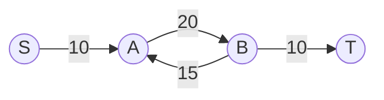

 The altered graph $G'$ for the above graph will be:

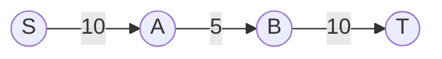

The maximum flow $f'$ in $G'$ will have a value of $5$. While it is true that $f'$ is feasible flow in $G$, $f'$ is not the maximum flow of $G$, since the value of maximum flow in $G$ is $10$. Thus the statement *"every maximum $(s, t)$-flow in $G'$ is also a maximum $(s, t)$-flow in $G$."* is false.

---

(b) 

Let $(S', T')$ be the minimum $(s,t)$-cut in $G'$. If the opposing pair of edges between the vertices $u$ and $v$ are such that $u\in S'$, and $v \in T'$, then this cut will have an increased value in $G$, since $c'(u\rightarrow v) < c(u\rightarrow v)$. Similarly for the other case: every minimum $(s,t)$-cut $(S,T)$ in $G$ will not be the minimum $(s,t)$-cut in $G'$ since the opposing pair of edge is reduced in $G'$, thus having the lesser minimum $(s,t)$-cut value than $G$.

Take the counter example of $G$ and $G'$ mentioned in the previous part. Here $(S',T') = (\{s,a\},\{b,t\})$, with $\|(S',T')\|=5.$ However in the network $G$, the cut $(S', T')$ is not the minimum cut, since in $G$ this cut has a value of 20. 

One of the minimum $(s,t)$-cut in G is $(\{s\},\{a,b,t\})$, with $\|S,T\|=10$, but, this is not the minimum $(s,t)$-cut in $G'$ 

It is possible for some minimum cut to exist in $G$ that would also be the minimum cut in $G'$ and vice verca, provided that the opposing pairs are not involved in any of the cuts. Thus the statement *"every minimum $(s, t)$-cut in $G$ is also a minimum $(s, t)$-cut in $G'$ and vice versa."* is false.

---

(c) 

It is trivial to note that there exist some edge $e$ in $G'$ such that $c(e)<c'(e)$. Thus, if there is a flow in $G$ that saturates $e$, then it will not be feasible in $G'$ and thus there would exist a flow in $G$ but not in $G'$.

However since the statement in the question (c) is regarding the maximum flow, it is false because there can be a graph $G$ whose maximum flow is equivalent in $G'$ as it does not involve the opposing pair of edge. It is possible to construct an counter-example for disproving the assumption in (c). Consider the following flow network $G$:

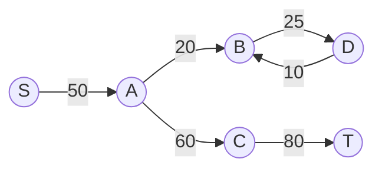

The altered graph $G'$ for the above graph $G$ will be:

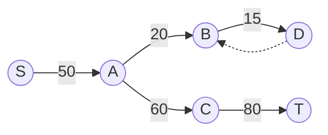

We can see there is exactly one flow $f$ for $G$, i.e $f(s\rightarrow a)=f(a\rightarrow c)=f(c\rightarrow t)=50$. This maximum flow $f$ is also the maximum flow for $G'$. Thus it is possible to construct a graph $G$ for which all maximum flow in $G'$ are also maximum flows. However, if we confine the graph such that the target is reachable from the vertices having the opposing pair of edges, then it is always possible to select a maximum flow $f$ in $G$ with some portion of the flow going though the opposing pair of edges, which will ensure that the same flow $f$ is not feasible in $G'$. But in general, the assumption in (c) is not true. So for a graph in which the opposing pair of edges cannot reach the target $t$, the statement *"there is at least one maximum $(s, t)$-flow in $G$ that is not a maximum $(s, t)$-flow in $G$."* is false.

---

### Question 5

*(a) Describe an efficient algorithm to determine whether a given flow network contains a unique maximum (s, t)-flow.*
*(b) Describe an efficient algorithm to determine whether a given flow network contains a unique minimum (s, t)-cut.*
*(c) Describe a flow network that contains a unique maximum (s, t)-flow but does not contain a unique minimum (s, t)-cut.*
*(d) Describe a flow network that contains a unique minimum (s, t)-cut but does not contain a unique maximum (s, t)-flow.[Question 5 of  Chapter 10 of "Algorithms" by Jeff Erikson]*

**Solution:**

(a) 

We first compute the maximum flow $|f|$ and also also store the path and the edges that provide the max flow. Now for each edge decrement the capacity of the edge by 1.
For each iteration calculate the maximum flow $|f’|$. Now on comparing this flow with the original flow $|f|$, if the new flow is equal to the previous flow, then the maximum flow is not unique.

(b)

We initially find the maximum flow of the network. Now, let $A$ be the set of all vertices reachable from the source via an augmenting path, and let $B$ be the set of all vertices such that the target can be reached from them via an augmenting path. Let $A^c$ be the complement of $A$ and $B^c$ be the complement of $B$.

Now, it is trivial to see that $(A, A^c)$ is a minimum cut, and so is $(B^c, B)$. The minimum cut is unique iff $(A, A^c) = (B^c, B)$

(c)

We define an abstract flow network as 

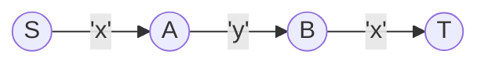

Then if $x<y$, there exists a unique maximum flow, i.e pushing the flow $x$ along $S\rightarrow A\rightarrow B \rightarrow T$, but non-unique minimum cuts $(\{S\},\{A,B,T\})$ and $(\{S, A, B\},\{T\})$.

(d)

We define an abstract flow network as

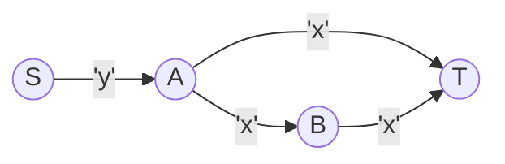

Similar to (c), if we put $x>y$, there exists a unique minimum cut $(\{S\}, \{A,B,T\})$, but non-unique maximum flows, since the maximum flow value of y can be pushed either through $S\rightarrow A\rightarrow T$ or $S\rightarrow A \rightarrow B \rightarrow T$.

### Question 6

*A new assistant professor, teaching maximum flows for the first time, suggests the following greedy modification to the generic Ford-Fulkerson augmenting path algorithm. Instead of maintaining a residual graph, just reduce the capacity of edges along the augmenting path! In particular, whenever we saturate an edge, just remove it from the graph. Who needs all that residual graph nonsense?*

*(a) Show that GreedyFlow does not always compute a maximum flow.*

*(b) Show that GreedyFlow is not even guaranteed to compute a good approximation to the maximum flow. That is, for any constant α > 1,
there is a flow network G such that the value of the maximum flow is more than α times the value of the flow computed by GreedyFlow.
[Hint: Assume that GreedyFlow chooses the worst possible path π at each iteration.] [Q17 of  Chapter 10 of "Algorithms" by Jeff Erikson]*

a) 

If we take a simple example, 

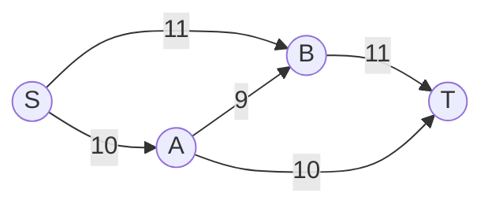

Let's say that `GreedyFlow` works as follows

-  It finds, path $S \rightarrow A \rightarrow B \rightarrow T$, with bottleneck flow=9, removing Edge $A \rightarrow B$ in the process

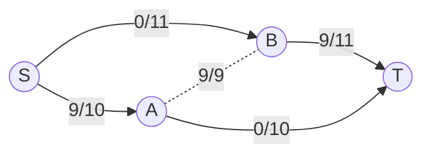

-  Next, it finds, path $S \rightarrow B \rightarrow T$, with bottleneck flow=2, removing Edge $B \rightarrow T$ in the process

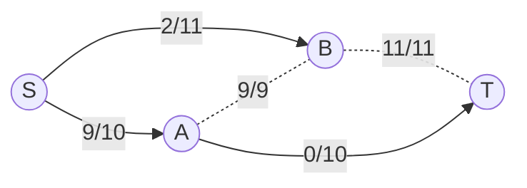

- Finally, it finds, path $S \rightarrow A \rightarrow T$, with bottleneck flow=1, removing Edge $S \rightarrow A$ in the process

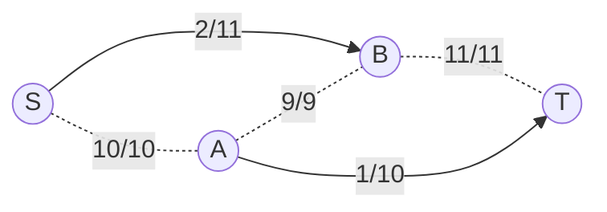

There does not exist any other path, so the algorithm has converged at $|f|=12$, but the optimal answer is $|f|=21$ (Obtained by pushing 11 through $S \rightarrow B \rightarrow T$, and 10 through $S\rightarrow A \rightarrow T$), which is missed by the `GreedyFLow` algorithm.

b) 

Working in the same approach as before, we define a network flow graph as

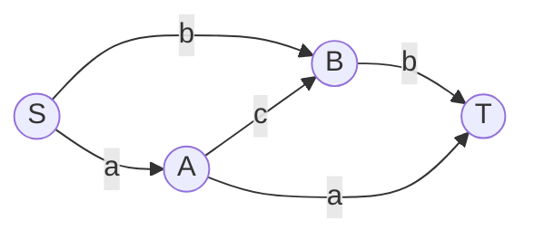

Where $a, b, c$ are capacities for the given edges, such that $a>b>c$

In this setup, the Best flow $f_{best}$ will have the flow value 
$$
|f_{best}| = a+b
$$
However, with `GreedyFlow` algorithm we can select the worst flow $f_{worst}$ by choosing to saturate and eliminate the edge $A \rightarrow B$ , and push $c$ along the path $S \rightarrow A \rightarrow B \rightarrow T$ as shown

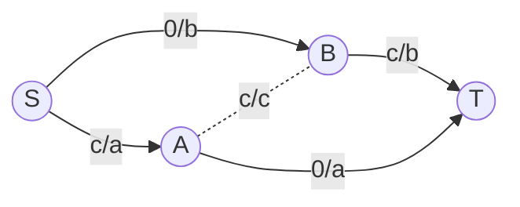

Next, with only 2 independant paths remaining we push a flow of $(b-c)$ along $S \rightarrow B \rightarrow T$ and  a flow of $(a-c)$ along $S \rightarrow A \rightarrow T$, eliminating edges $B \rightarrow T$ and $S \rightarrow A$

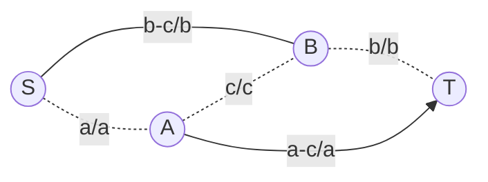

$$
\text{Thus, }\\
|f_{worst}|=\delta f_{worst}(S) = a+b-c \\
\implies \alpha = \frac{|f_{best}|}{|f_{worst}|} \\
\implies \alpha = \frac{a+b}{a+b-c} \\
\\ \text{Since } a>b>c>0, \text{put}\\
b=c+x, \hskip{2em} a = c+x+y \hskip{2em} x,y,c > 0 \\
\alpha = \frac{(c+x+y)+(c+x)}{(c+x+y)+(c+x)-c} \\
\alpha = \frac{2c+2x+y}{c+2x+y} \\
\implies \alpha c + \alpha(2x+y) = 2c + (2x+y) \\
\implies (\alpha-2)c  = (2x+y)(1-\alpha) \\
\implies c  = \frac{(2x+y)(1-\alpha)}{(\alpha-2)} \\
\text{Since }x,y,c > 0, \text{We need only positive values of c}\\
c>0 \implies \frac{(2x+y)(1-\alpha)}{(2-\alpha)} > 0 \\
\implies \frac{1-\alpha}{2-\alpha} > 0 \\
\text{This term is positive only iff} \\
1<\alpha<2
$$

Thus, it is possible to make a network of 4 nodes in this way for which `GreedyFlow` can give $\alpha$ times worse result from the optimum solution, where $\alpha \in (1,2)$. However, It is always possible to make a network of multiple such subgraphs/arrangements, with each arrangement providing more 'contribution' to a worse score for `GreedyFlow`  compared to the optimum solution. 

Hence, It is always possible to form a network for which `GreedyFlow` gives a score $\alpha$ times worse than the optimum result where $\alpha>1$ 

---

